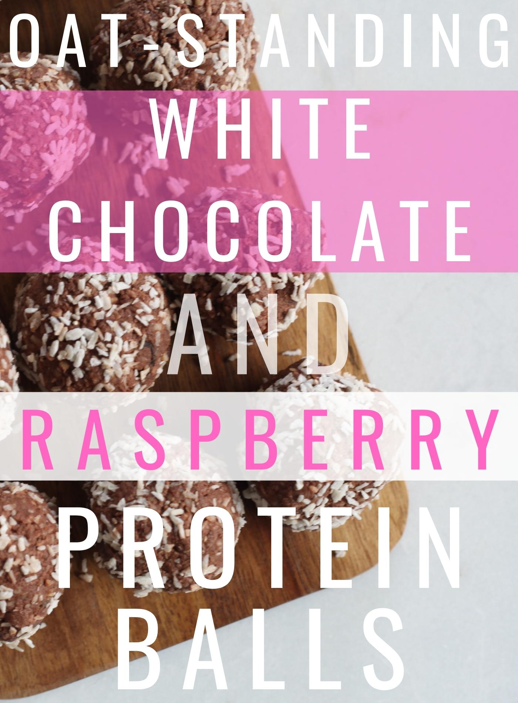

Learning to combine Health with Cravings is a true game-changer when it comes to a balanced diet! This protein and oat-based snack will garuntee your sweet-tooth to be satisfied and regret-FREE.

*Servings:* 1-2 portions (approx. 10 balls)

*Total Prep Time:* 7mins

*Total Time:* 2hrs (reccomended to be prepped overnight)

* 29 grams (average: 1 scoop) White Chocolate/Coco Protein Powder
* 1 Cup Organic Oats
* 1/2 Cup Oat Milk
* 1/2 Cup Water
* 1/8 Teaspoon Kosher Salt
* 1 Tablespoon Honey
* 1/4 Cup Frozen Crushed Raspberries (optional)

*Let's get started!*