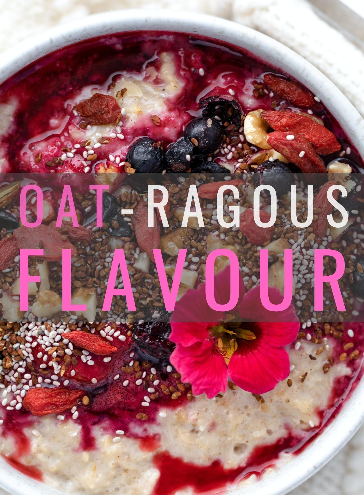

# Let's Begin!

You will need...

* 1/2 cup [rolled oats](https://oatseveryday.com/know-your-oats-2/#rolled-oats) (125 ml)
* 1 cup milk dairy or non-dairy (250 ml)
* 1 Tbsp honey or agave (15 ml)
* 1/4 cup yogurt vanilla (60 ml)
* 1 cup berries strawberry, raspberry, blueberry or blackberry, frozen (250 ml)

## Servings: 1

## Time: 8mins

## Ready, Set, OAT!